# Gmail Explorer Visualizer

###### By [nickesc](https://github.com/nickesc) / [N. Escobar](https://nickesc.com)


```python
import os
import csv
import base64
import pandas as pd
import seaborn as sns
import numpy as np
import sklearn
import matplotlib.pyplot as plt
import datetime
from scipy.stats import zscore
from matplotlib import rcParams

# figure size in inches
rcParams['figure.figsize'] = 10,10
sns.set(rc={'figure.figsize':(11.7,8.27)})
color = ['blue','green','orange','red']

from IPython.display import clear_output, display
#from ipywidgets import *
#from tkinter import Tk, filedialog
#from math import floor
```

## Looking at the data!

Finally! Our data is in a format we can really work with! We're only going to worry about the received messages for now, but we still have the chats, sent and drafts if we want them later. This is a fairly preliminary look at the data, most of my time was spent on getting collection and imputing done -- I definitely want to continue to work on this project. I have a few places I'd like to go though, and some interesting thoughts based on the current visualizations. Lets load the emails into the notebook (dropping an extra, unnamed column for some reason which I'm sure is my fault):


```python
messages = pd.read_csv("../imputer/imputed/recieved.csv")
messages.drop(messages.columns[messages.columns.str.contains('unnamed',case = False)],axis = 1, inplace = True)
messages.head()

```


<div>
<style scoped>
    .dataframe tbody tr th:only-of-type {
        vertical-align: middle;
    }

    .dataframe tbody tr th {
        vertical-align: top;
    }

    .dataframe thead th {
        text-align: right;
    }
</style>
<table border="1" class="dataframe">
  <thead>
    <tr style="text-align: right;">
      <th></th>
      <th>id</th>
      <th>threadId</th>
      <th>from</th>
      <th>delivered</th>
      <th>to</th>
      <th>internalDate</th>
      <th>dateTime</th>
      <th>year</th>
      <th>month</th>
      <th>day</th>
      <th>labels</th>
      <th>sizeEstimate</th>
      <th>subject</th>
      <th>body</th>
    </tr>
  </thead>
  <tbody>
    <tr>
      <th>0</th>
      <td>1340953ff42a62c8</td>
      <td>1340953ff42a62c8</td>
      <td>accounts@mochigames.com</td>
      <td>josephgoodman85@gmail.com</td>
      <td>josephgoodman85@gmail.com</td>
      <td>1323006426000</td>
      <td>2011-12-04 08:47:06</td>
      <td>2011</td>
      <td>12</td>
      <td>4</td>
      <td>['CATEGORY_UPDATES']</td>
      <td>7036</td>
      <td>Welcome to MochiGames goofyshnoofy!</td>
      <td>V2VsY29tZSB0byBNb2NoaUdhbWVzLCBnb29meXNobm9vZn...</td>
    </tr>
    <tr>
      <th>1</th>
      <td>136dc4cb8ea460d1</td>
      <td>136dc4cb8ea460d1</td>
      <td>pottermore@mail.pottermore.com</td>
      <td>josephgoodman85@gmail.com</td>
      <td>josephgoodman85@gmail.com</td>
      <td>1335135875000</td>
      <td>2012-04-22 19:04:35</td>
      <td>2012</td>
      <td>4</td>
      <td>22</td>
      <td>['CATEGORY_UPDATES']</td>
      <td>11169</td>
      <td>Pottermore registration</td>
      <td>PCFET0NUWVBFIEhUTUwgUFVCTElDICItLy9XM0MvL0RURC...</td>
    </tr>
    <tr>
      <th>2</th>
      <td>136dc4ddab520861</td>
      <td>136dc4ddab520861</td>
      <td>pottermore@mail.pottermore.com</td>
      <td>josephgoodman85@gmail.com</td>
      <td>josephgoodman85@gmail.com</td>
      <td>1335135950000</td>
      <td>2012-04-22 19:05:50</td>
      <td>2012</td>
      <td>4</td>
      <td>22</td>
      <td>['CATEGORY_PROMOTIONS']</td>
      <td>9236</td>
      <td>Your Pottermore account is ready! Step this wa...</td>
      <td>DQo8aHRtbCB4bWxucz0iaHR0cDovL3d3dy53My5vcmcvMT...</td>
    </tr>
    <tr>
      <th>3</th>
      <td>136ebd147fcd9bba</td>
      <td>136ebd147fcd9bba</td>
      <td>pottermore@mail.pottermore.com</td>
      <td>josephgoodman85@gmail.com</td>
      <td>josephgoodman85@gmail.com</td>
      <td>1335396221000</td>
      <td>2012-04-25 19:23:41</td>
      <td>2012</td>
      <td>4</td>
      <td>25</td>
      <td>['CATEGORY_UPDATES']</td>
      <td>9724</td>
      <td>Pottermore: Password Reset</td>
      <td>PGh0bWwgeG1sbnM9Imh0dHA6Ly93d3cudzMub3JnLzE5OT...</td>
    </tr>
    <tr>
      <th>4</th>
      <td>13750efdfd5fd883</td>
      <td>13750efdfd5fd883</td>
      <td>pottermore@mail.pottermore.com</td>
      <td>josephgoodman85@gmail.com</td>
      <td>josephgoodman85@gmail.com</td>
      <td>1337092709000</td>
      <td>2012-05-15 10:38:29</td>
      <td>2012</td>
      <td>5</td>
      <td>15</td>
      <td>['CATEGORY_PROMOTIONS']</td>
      <td>33234</td>
      <td>The Harry Potter stories are now available as ...</td>
      <td>UG90dGVybW9yZTogRW1haWwjYnRuIGE6bGluaywgI2J0bi...</td>
    </tr>
  </tbody>
</table>
</div>


```python
msg_filtered = messages[(messages['delivered'] == "josephgoodman85@gmail.com") | (messages['delivered'] == "nickesc.gd@gmail.com") | (messages['delivered'] == "nescobar@oxy.edu") | (messages['delivered'] == "nickesc.media@gmail.com")]
msg_filtered
```


<div>
<style scoped>
    .dataframe tbody tr th:only-of-type {
        vertical-align: middle;
    }

    .dataframe tbody tr th {
        vertical-align: top;
    }

    .dataframe thead th {
        text-align: right;
    }
</style>
<table border="1" class="dataframe">
  <thead>
    <tr style="text-align: right;">
      <th></th>
      <th>id</th>
      <th>threadId</th>
      <th>from</th>
      <th>delivered</th>
      <th>to</th>
      <th>internalDate</th>
      <th>dateTime</th>
      <th>year</th>
      <th>month</th>
      <th>day</th>
      <th>labels</th>
      <th>sizeEstimate</th>
      <th>subject</th>
      <th>body</th>
    </tr>
  </thead>
  <tbody>
    <tr>
      <th>0</th>
      <td>1340953ff42a62c8</td>
      <td>1340953ff42a62c8</td>
      <td>accounts@mochigames.com</td>
      <td>josephgoodman85@gmail.com</td>
      <td>josephgoodman85@gmail.com</td>
      <td>1323006426000</td>
      <td>2011-12-04 08:47:06</td>
      <td>2011</td>
      <td>12</td>
      <td>4</td>
      <td>['CATEGORY_UPDATES']</td>
      <td>7036</td>
      <td>Welcome to MochiGames goofyshnoofy!</td>
      <td>V2VsY29tZSB0byBNb2NoaUdhbWVzLCBnb29meXNobm9vZn...</td>
    </tr>
    <tr>
      <th>1</th>
      <td>136dc4cb8ea460d1</td>
      <td>136dc4cb8ea460d1</td>
      <td>pottermore@mail.pottermore.com</td>
      <td>josephgoodman85@gmail.com</td>
      <td>josephgoodman85@gmail.com</td>
      <td>1335135875000</td>
      <td>2012-04-22 19:04:35</td>
      <td>2012</td>
      <td>4</td>
      <td>22</td>
      <td>['CATEGORY_UPDATES']</td>
      <td>11169</td>
      <td>Pottermore registration</td>
      <td>PCFET0NUWVBFIEhUTUwgUFVCTElDICItLy9XM0MvL0RURC...</td>
    </tr>
    <tr>
      <th>2</th>
      <td>136dc4ddab520861</td>
      <td>136dc4ddab520861</td>
      <td>pottermore@mail.pottermore.com</td>
      <td>josephgoodman85@gmail.com</td>
      <td>josephgoodman85@gmail.com</td>
      <td>1335135950000</td>
      <td>2012-04-22 19:05:50</td>
      <td>2012</td>
      <td>4</td>
      <td>22</td>
      <td>['CATEGORY_PROMOTIONS']</td>
      <td>9236</td>
      <td>Your Pottermore account is ready! Step this wa...</td>
      <td>DQo8aHRtbCB4bWxucz0iaHR0cDovL3d3dy53My5vcmcvMT...</td>
    </tr>
    <tr>
      <th>3</th>
      <td>136ebd147fcd9bba</td>
      <td>136ebd147fcd9bba</td>
      <td>pottermore@mail.pottermore.com</td>
      <td>josephgoodman85@gmail.com</td>
      <td>josephgoodman85@gmail.com</td>
      <td>1335396221000</td>
      <td>2012-04-25 19:23:41</td>
      <td>2012</td>
      <td>4</td>
      <td>25</td>
      <td>['CATEGORY_UPDATES']</td>
      <td>9724</td>
      <td>Pottermore: Password Reset</td>
      <td>PGh0bWwgeG1sbnM9Imh0dHA6Ly93d3cudzMub3JnLzE5OT...</td>
    </tr>
    <tr>
      <th>4</th>
      <td>13750efdfd5fd883</td>
      <td>13750efdfd5fd883</td>
      <td>pottermore@mail.pottermore.com</td>
      <td>josephgoodman85@gmail.com</td>
      <td>josephgoodman85@gmail.com</td>
      <td>1337092709000</td>
      <td>2012-05-15 10:38:29</td>
      <td>2012</td>
      <td>5</td>
      <td>15</td>
      <td>['CATEGORY_PROMOTIONS']</td>
      <td>33234</td>
      <td>The Harry Potter stories are now available as ...</td>
      <td>UG90dGVybW9yZTogRW1haWwjYnRuIGE6bGluaywgI2J0bi...</td>
    </tr>
    <tr>
      <th>...</th>
      <td>...</td>
      <td>...</td>
      <td>...</td>
      <td>...</td>
      <td>...</td>
      <td>...</td>
      <td>...</td>
      <td>...</td>
      <td>...</td>
      <td>...</td>
      <td>...</td>
      <td>...</td>
      <td>...</td>
      <td>...</td>
    </tr>
    <tr>
      <th>87430</th>
      <td>17f14a27dd9a9b7d</td>
      <td>17f14a27dd9a9b7d</td>
      <td>no-reply@mail.instagram.com</td>
      <td>josephgoodman85@gmail.com</td>
      <td>josephgoodman85@gmail.com</td>
      <td>1645318654000</td>
      <td>2022-02-19 19:57:34</td>
      <td>2022</td>
      <td>2</td>
      <td>19</td>
      <td>['UNREAD', 'CATEGORY_SOCIAL', 'INBOX']</td>
      <td>26182</td>
      <td>ijustwantedclothes, see what's been happening ...</td>
      <td>PCFET0NUWVBFIEhUTUwgUFVCTElDICItLy9XM0MvL0RURC...</td>
    </tr>
    <tr>
      <th>87431</th>
      <td>17f14af10caa271c</td>
      <td>17f14af10caa271c</td>
      <td>noreply@uber.com</td>
      <td>nickesc.gd@gmail.com</td>
      <td>nickesc.gd@gmail.com</td>
      <td>1645319490000</td>
      <td>2022-02-19 20:11:30</td>
      <td>2022</td>
      <td>2</td>
      <td>19</td>
      <td>['CATEGORY_PROMOTIONS', 'UNREAD', 'INBOX']</td>
      <td>126617</td>
      <td>Your weekly deals are here, Nick 🌟</td>
      <td>PCFkb2N0eXBlIGh0bWw-DQo8aHRtbCB4bWxucz0iaHR0cD...</td>
    </tr>
    <tr>
      <th>87432</th>
      <td>17f1575c1426497e</td>
      <td>17f1575c1426497e</td>
      <td>noreply@redditmail.com</td>
      <td>josephgoodman85@gmail.com</td>
      <td>josephgoodman85@gmail.com</td>
      <td>1645332512000</td>
      <td>2022-02-19 23:48:32</td>
      <td>2022</td>
      <td>2</td>
      <td>19</td>
      <td>['CATEGORY_PROMOTIONS', 'UNREAD', 'INBOX']</td>
      <td>103349</td>
      <td>"Spilled the entire grinder full of keif this..."</td>
      <td>PCFET0NUWVBFIGh0bWwgUFVCTElDICItLy9XM0MvL0RURC...</td>
    </tr>
    <tr>
      <th>87433</th>
      <td>17f15a705a5f7989</td>
      <td>17f15a705a5f7989</td>
      <td>noreply@uber.com</td>
      <td>nickesc.gd@gmail.com</td>
      <td>nickesc.gd@gmail.com</td>
      <td>1645335740000</td>
      <td>2022-02-20 00:42:20</td>
      <td>2022</td>
      <td>2</td>
      <td>20</td>
      <td>['UNREAD', 'CATEGORY_UPDATES', 'INBOX']</td>
      <td>83724</td>
      <td>Your Saturday evening order with Uber Eats</td>
      <td>PCFkb2N0eXBlIGh0bWw-PGh0bWw-PGhlYWQ-PG1ldGEgY2...</td>
    </tr>
    <tr>
      <th>87434</th>
      <td>17f15ab170b8f99e</td>
      <td>17f15a705a5f7989</td>
      <td>noreply@uber.com</td>
      <td>nickesc.gd@gmail.com</td>
      <td>nickesc.gd@gmail.com</td>
      <td>1645336007000</td>
      <td>2022-02-20 00:46:47</td>
      <td>2022</td>
      <td>2</td>
      <td>20</td>
      <td>['UNREAD', 'CATEGORY_PERSONAL', 'INBOX']</td>
      <td>90516</td>
      <td>Your Saturday evening order with Uber Eats</td>
      <td>PCFkb2N0eXBlIGh0bWw-PGh0bWw-PGhlYWQ-PG1ldGEgY2...</td>
    </tr>
  </tbody>
</table>
<p>87058 rows × 14 columns</p>
</div>


```python
#colors = sns.color_palette('tab10')
# plt.pie(.value_counts(), colors = sns.color_palette('tab10'),labels = msg_filtered.keys())

pie1 = msg_filtered.groupby(['delivered']).count().plot(kind='pie', y='sizeEstimate', figsize=(20, 20), labels = msg_filtered.groupby(['delivered']).count().index, autopct='%1.1f%%', ylabel="Inbox Distribution", colors=color, explode = (0, 0,0, .1)  )

#plt.show()
```


    
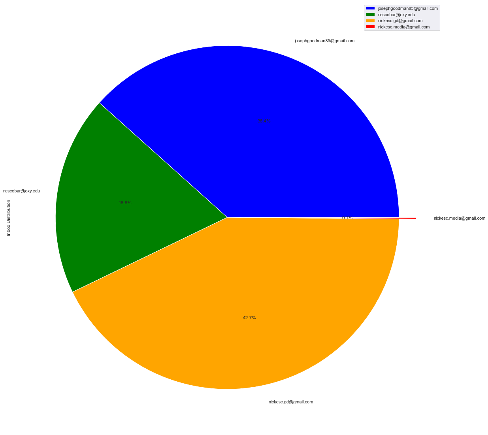
    


```python
sns.countplot(x='delivered',data=msg_filtered)
```


    <AxesSubplot:xlabel='delivered', ylabel='count'>


    
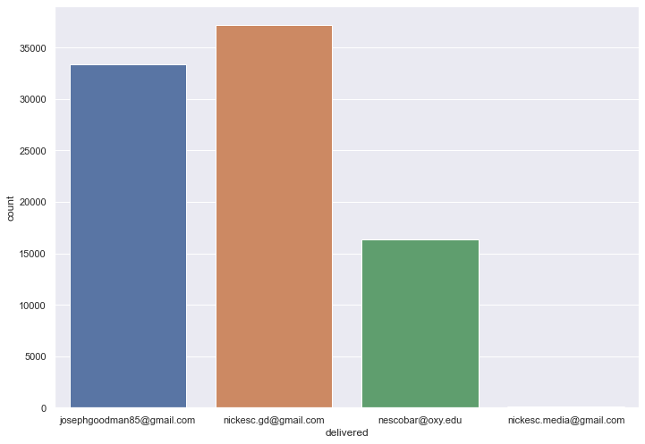
    


First, let's take a look at the overall distribution of emails in my inbox. We can see that the vast majority of emails have been sent to `josephgoodman85@gmail.com` (JG) and `nickesc.gd@gmail.com` (GD). A relatively smaller amount comes from my Oxy email, `nescobar@oxy.edu` and virtually no mail is sent to `nickesc.media@gmail.com` (NM). Let's take a slightly closer look though.

## Tracking email account use over time


```python
sns.histplot(data=msg_filtered.drop(columns=['body']), x="internalDate", hue = 'delivered', kde=True)
sns.rugplot(data=msg_filtered.drop(columns=['body']), x="internalDate", hue = 'delivered', height=.02)
plt.figure(figsize = (15,8))
plt.show()

```


    
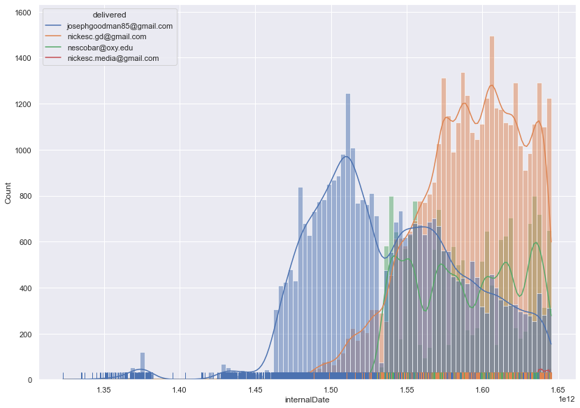
    


    <Figure size 1080x576 with 0 Axes>


```python
ax = sns.violinplot(x="year", y="delivered", data=msg_filtered.drop(columns=['body']))
#ax.tick_params(left=False, bottom=False, top=True, right=True)
#ax.set_tickLabels(left=False, bottom=False, top=True, right=True)

#ax.axes.xaxis.set_ticklabels([])
ax.axes.yaxis.set_ticklabels(['JG', 'GD', 'NE', 'NM'])
plt.figure(figsize = (15,8))
plt.show()
```


    
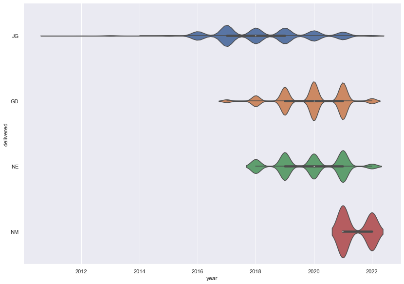
    


    <Figure size 1080x576 with 0 Axes>


Looking at this, we get a little more information. We start to see some trends forming in my email use -- this graph is over time, starting in Dec 2011 going until Feb 2022. First off, we can see the distribution over time of the accounts, with JG starting with the most use, until GD is introduced in 2017, where we see a sharp drop off in JG's emails, and which continue to lower as GD goes up. You can see in the rugplot at the bottom exactly where the shift occurs.

> Those trends all track with my real life email use -- I transitioned my main email to one that actually had my name instead of *'Joseph Goodman.' I moved most things to the new email during the beginning and middle of 2018, which is when we see a sharp increase, and started using JG mostly for spam.

Next, we can see the introduction of NE, which starts at a high use already with hardly any build up. For the most part, that number stays consistent, but with a dip in 2020. The addition of this email address seems to have had a minor impact on GD, the main email at the time.

> Again, we can track this with real life: thsi was when I started at Oxy and got my Oxy email, which came with a ton of subscriptions to school newsletters already. Those emails continued pretty consistently while I was at school, but when we were sent home in 2020 to isolate, the emails decreased because nothing was happening on campus at the time. They pick back up when I come back to LA though, which explains why they rebound to exactly where they were before.

The last addition, NM, is hard to see on the first graph, but we can tell that it was introduced in mid 2020-2021 from the second. It's emails are only spread out over two years, but it has under 100 emails in its inbox.

> This email was used mostly as a bot for a website I set up that would send email notifications to people when I updated on the site. It isn't really an active email account, so it doesn't have very many emails, it's used for projects and a handful of other accounts.


## Looking at frequency, size, and patterns


```python
sns.pairplot(data=msg_filtered.drop(columns=['body']))
```


    <seaborn.axisgrid.PairGrid at 0x7fcdec1ddb80>


    
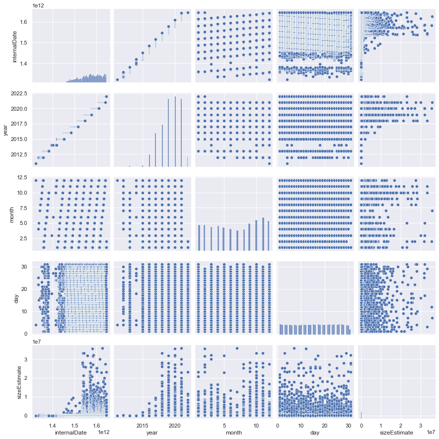
    


The two pairplots here were some of the most interesting parts of this. The first time I looked at them it was the completely blue version, without account differentiation. I looked at the year-over-year graph, where I saw the first part of the shape of the graph above. It also showed me how there are months I get more emails, at the end of the year and dipping around the summer, presumably because of things like holiday advertising. They also showed a relationship between time and size that confused me. In the top let, you can see that at some point the size of emails skyrockets -- I had no idea why and wanted to get to the bottom of it. SO I looked deeper at the individual accounts, and found some answers.


```python
sns.pairplot(msg_filtered,hue='delivered')
```


    <seaborn.axisgrid.PairGrid at 0x7fce0ca64f70>


    
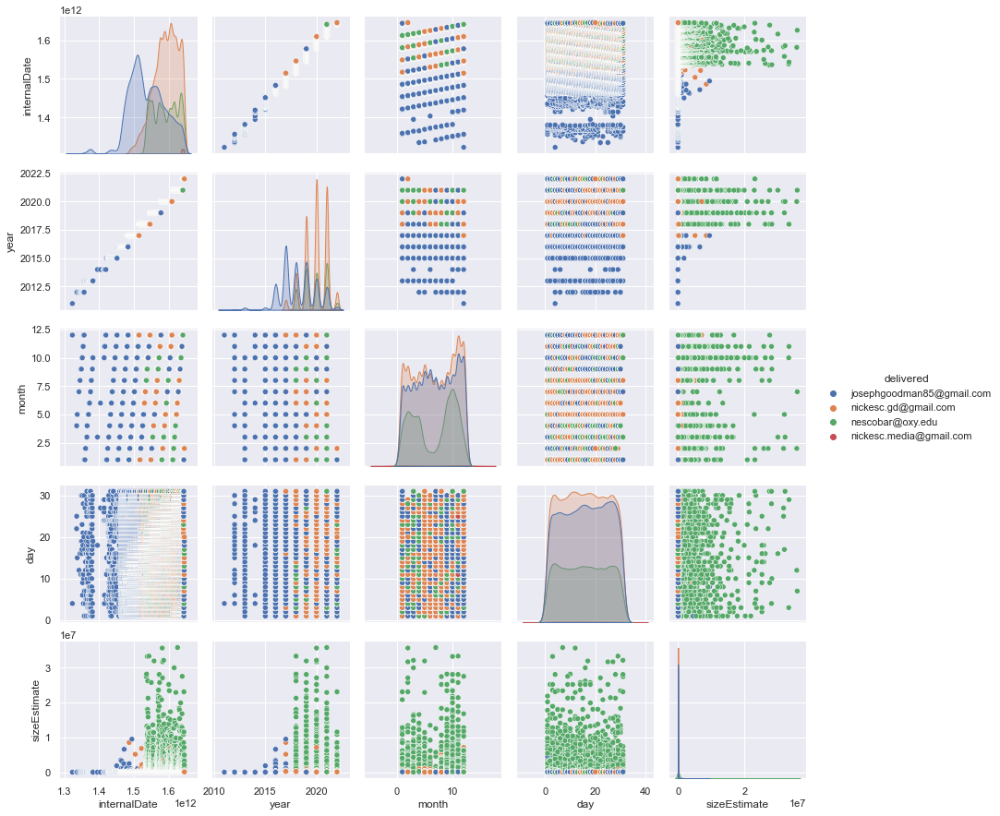
    


In the second pairplot, we can see a lot more information -- we see the distribution for individual accounts over time, the basis for the graph above, and we see the dip in months explained a little on the graph in the middle, monthly distribution -- during the summer, NE doesn't really get any mail because I'm out of school. We can also see I get about 80 new emails daily, but that JG and GD sit about equal, while NE halves them and NM is no where to be seen. You can also see the transition to GD from JG in the year over month graph. 

And we get some more clarity on the size question -- the even that increased sizes was the introduction on NE. Emails to NE, presumable from Oxy, as they are the unique emails on that account, and they take up significantly more space, by about 6 times on average. I don't know what it is about those emails, but they are not space efficient. 


```python
sns.scatterplot(x = msg_filtered['year'],y = msg_filtered['sizeEstimate'], hue=msg_filtered['delivered'])
plt.xlabel('Year')
plt.ylabel('Size Estimate')
plt.show()
```


    
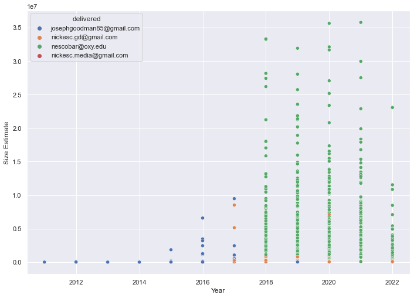
    


```python
sns.scatterplot(x = msg_filtered['internalDate'],y = msg_filtered['sizeEstimate'], hue=msg_filtered['delivered'])
plt.xlabel('Internal Date')
plt.ylabel('Size Estimate')
plt.show()
```


    
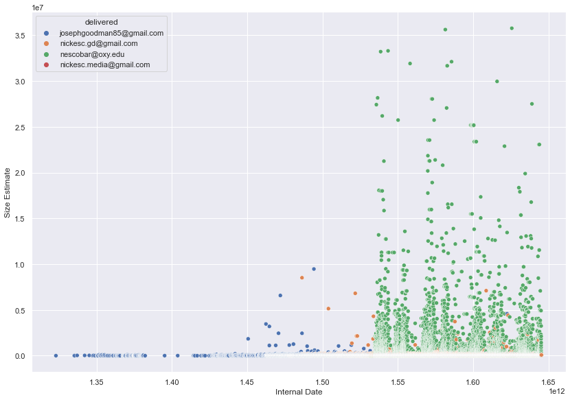
    


```python
sns.barplot(x='delivered',y='sizeEstimate',data=msg_filtered)
```


    <AxesSubplot:xlabel='delivered', ylabel='sizeEstimate'>


    
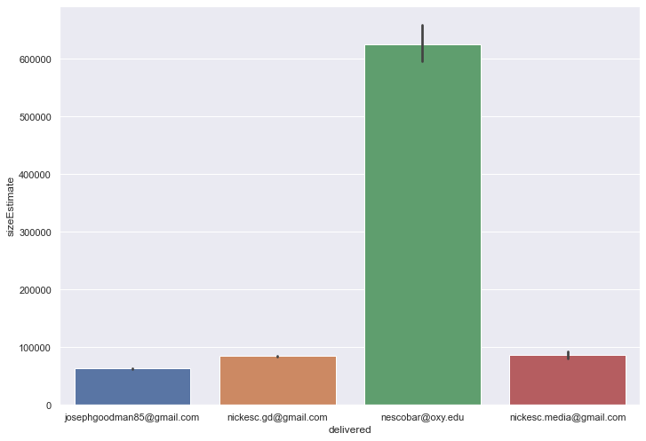
    


## Body and subject relationship


```python
def getDecodeLen(string):
    try:
    
        decode = base64.urlsafe_b64decode(string).decode('utf-8')
    except:
        decode = ""
        #print("failed on", string)
    return len(decode)

def getLen(string):
    return len(string)
```


```python
lengs = messages[['body', 'subject']].copy()

lengs['body']=lengs['body'].apply(getDecodeLen)
lengs['subject']=lengs['subject'].apply(getLen)

lengs


```


<div>
<style scoped>
    .dataframe tbody tr th:only-of-type {
        vertical-align: middle;
    }

    .dataframe tbody tr th {
        vertical-align: top;
    }

    .dataframe thead th {
        text-align: right;
    }
</style>
<table border="1" class="dataframe">
  <thead>
    <tr style="text-align: right;">
      <th></th>
      <th>body</th>
      <th>subject</th>
    </tr>
  </thead>
  <tbody>
    <tr>
      <th>0</th>
      <td>787</td>
      <td>35</td>
    </tr>
    <tr>
      <th>1</th>
      <td>8516</td>
      <td>23</td>
    </tr>
    <tr>
      <th>2</th>
      <td>6671</td>
      <td>50</td>
    </tr>
    <tr>
      <th>3</th>
      <td>6992</td>
      <td>26</td>
    </tr>
    <tr>
      <th>4</th>
      <td>2318</td>
      <td>52</td>
    </tr>
    <tr>
      <th>...</th>
      <td>...</td>
      <td>...</td>
    </tr>
    <tr>
      <th>87430</th>
      <td>19858</td>
      <td>58</td>
    </tr>
    <tr>
      <th>87431</th>
      <td>113185</td>
      <td>34</td>
    </tr>
    <tr>
      <th>87432</th>
      <td>98530</td>
      <td>49</td>
    </tr>
    <tr>
      <th>87433</th>
      <td>72543</td>
      <td>42</td>
    </tr>
    <tr>
      <th>87434</th>
      <td>78840</td>
      <td>42</td>
    </tr>
  </tbody>
</table>
<p>87435 rows × 2 columns</p>
</div>


Finally, we come to the last part, a small exploration of the content of the messages. In the next few graphs, we compare the length of the message's subject with the length of its body and calculate the correlation coefficient. We see a really strange shape when we look at these graphs, made up of three distinct parts -- messages with a body > ~10500 characters have a smaller subject size, messages with a body < ~10500 characters have a larger subject size, and messages with a body < 300 characters have an even bigger subject size. I have absolutely no idea why it looks like that, but I imagine it has to do with the most frequent emails I get on each account.


```python
lengs.drop(lengs['body'].idxmax(), inplace=True)
lengs.drop(lengs['body'].idxmax(), inplace=True)
sns.pairplot(lengs)
```


    <seaborn.axisgrid.PairGrid at 0x7fce0a14f7c0>


    
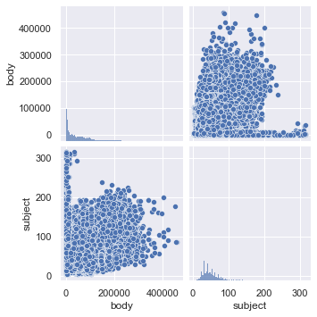
    


```python
corr = lengs.corr(method="pearson")["body"][1]
print("the correlation coefficient is", corr)
plt.scatter(lengs['body'], lengs['subject'])
plt.xlabel('body (chars)')
plt.ylabel('subject (chars)')
plt.show()
```

    the correlation coefficient is 0.1579934970411838


    
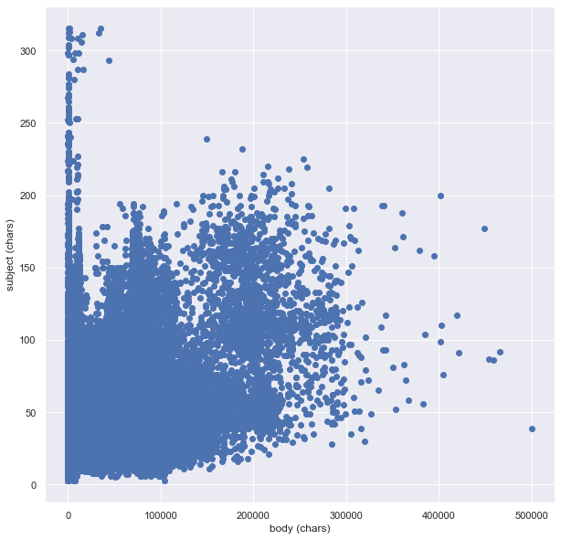
    


```python
lengsBig = lengs.loc[lengs['body']>10500]
lengsSmall = lengs.loc[lengs['body']<10500]
lengsSmaller = lengs.loc[lengs['body']<300]

z_scores = zscore(lengsBig)
abs_z_scores = np.abs(z_scores)
filtered_entries = (abs_z_scores < 7.5).all(axis=1)
lengsBig = lengsBig[filtered_entries]
```


```python
corr = lengsBig.corr(method="pearson")["body"][1]
print("the correlation coefficient is", corr)
plt.scatter(lengsBig['body'], lengsBig['subject'])
plt.xlabel('body (chars)')
plt.ylabel('subject (chars)')
plt.show()
```

    the correlation coefficient is 0.2698308286090695


    
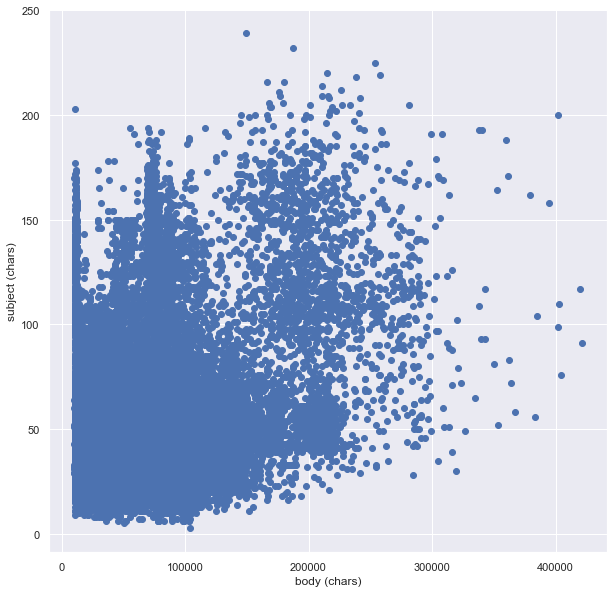
    


```python
corr = lengsSmall.corr(method="pearson")["body"][1]
print("the correlation coefficient is", corr)
plt.scatter(lengsSmall['body'], lengsSmall['subject'])
plt.xlabel('body (chars)')
plt.ylabel('subject (chars)')
plt.show()
```

    the correlation coefficient is -0.09134321058250898


    
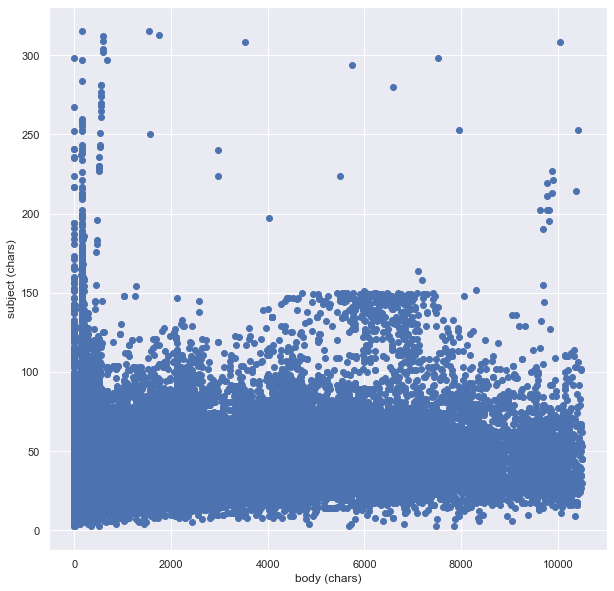
    


```python
corr = lengsSmaller.corr(method="pearson")["body"][1]
print("the correlation coefficient is", corr)
plt.scatter(lengsSmaller['body'], lengsSmaller['subject'])
plt.xlabel('body (chars)')
plt.ylabel('subject (chars)')
plt.show()
```

    the correlation coefficient is 0.0975900658864091


    
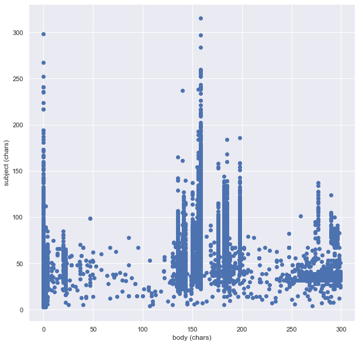
    

